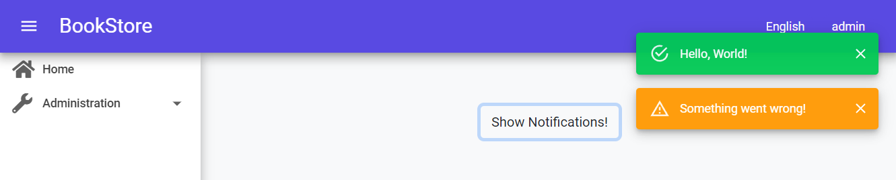

# MudBlazor Theme in ABP Blazor WebAssembly PART 2


## Introduction

This sample [ABP](https://abp.io/) Blazor WebAssembly project shows how to replace built-in [Notification](https://docs.abp.io/en/abp/latest/UI/Blazor/Notification) service to display notifications with [MudBlazor](https://www.mudblazor.com/)'s [Snackbar](https://www.mudblazor.com/components/snackbar#api) component. The source code is [avallable on GitHub](https://github.com/yellow-dragon-cloud/AbpMudBlazor2/).


## 5. Make Sure You Have Completed PART 1

This project is built on top of [MudBlazor Theme in ABP Blazor WebAssembly PART 1](https://github.com/yellow-dragon-cloud/AbpMudBlazor/). Therefore, you will first need to complete the steps shown in PART 1 to continue following the steps listed here.


## 6. Add [MudBlazor Snackbar](https://www.mudblazor.com/components/snackbar#api) Support To MainLayout

In the `Volo.Abp.AspNetCore.Components.Web.BasicTheme` project, open `MainLayout.razor`, add `<MudSnackbarProvider />` and remove `<UiNotificationAlert />`. The final content of the file should look like this:

```razor
@inherits LayoutComponentBase

<MudThemeProvider />
<MudSnackbarProvider />

<MudLayout>
    <MudAppBar Elevation="8">
        <MudIconButton Icon="@Icons.Material.Filled.Menu" Color="MudBlazor.Color.Inherit" Edge="Edge.Start" 
                       OnClick="@((e) => DrawerToggle())" />
        <Branding />
        <MudSpacer />
        <NavToolbar />
    </MudAppBar>
    <MudDrawer @bind-Open="_drawerOpen" ClipMode="DrawerClipMode.Always" Elevation="8">
        <NavMenu />
    </MudDrawer>
    <MudMainContent>
        <MudContainer MaxWidth="MaxWidth.False" Class="mt-4">
            <PageAlert />
            @Body
            <UiMessageAlert />
            <UiPageProgress />
        </MudContainer>
    </MudMainContent>
</MudLayout>

@code 
{
    private bool _drawerOpen = true;

    private void DrawerToggle()
    {
        _drawerOpen = !_drawerOpen;
    }
}
```


## 7. Replace [Notification Service](https://docs.abp.io/en/abp/latest/UI/Blazor/Notification)

In `Volo.Abp.AspNetCore.Components.Web.BasicTheme` project, create a folder named `Services`. Create `MudBlazorUiNotificationService.cs` file in this folder, and add the following content:

```csharp
using System;
using System.Threading.Tasks;
using MudBlazor;
using Volo.Abp.AspNetCore.Components.Notifications;
using Volo.Abp.DependencyInjection;

namespace Volo.Abp.AspNetCore.Components.Web.BasicTheme.Services;

[Dependency(ReplaceServices = true)]
public class MudBlazorUiNotificationService : IUiNotificationService, IScopedDependency
{
    private readonly ISnackbar _snackbar;

    public MudBlazorUiNotificationService(ISnackbar snackbar)
    {
        _snackbar = snackbar;
    }

    public Task Error(string message, string title = null, Action<UiNotificationOptions> options = null)
    {
        _snackbar.Add(message, Severity.Error);
        return Task.CompletedTask;
    }

    public Task Info(string message, string title = null, Action<UiNotificationOptions> options = null)
    {
        _snackbar.Add(message, Severity.Info);
        return Task.CompletedTask;
    }

    public Task Success(string message, string title = null, Action<UiNotificationOptions> options = null)
    {
        _snackbar.Add(message, Severity.Success);
        return Task.CompletedTask;
    }

    public Task Warn(string message, string title = null, Action<UiNotificationOptions> options = null)
    {
        _snackbar.Add(message, Severity.Warning);
        return Task.CompletedTask;
    }
}
```

The code shown above automatically replaces the built-in `IUiNotificationService` service. To learn more about this mechanism [see Overriding Services](https://docs.abp.io/en/abp/latest/Customizing-Application-Modules-Overriding-Services).

Now, modify `Index.razor` file to test MudBlazor style notifications:

```razor
@page "/"
@using Volo.Abp.AspNetCore.Components.Notifications
@inherits BookStoreComponentBase
@inject AuthenticationStateProvider AuthenticationStateProvider
@inject IUiNotificationService NotificationService

<div class="container">
    <div class="p-5 text-center">
        <Button onclick="@(async () => { await NotificationService.Success("Hello, World!"); await NotificationService.Warn("Something went wrong!"); })">
            Show Notifications!
        </Button>
    </div>
</div>
```


## The Result




## Next

[MudBlazor Theme in ABP Blazor WebAssembly PART 3](https://github.com/yellow-dragon-cloud/AbpMudBlazor3)

